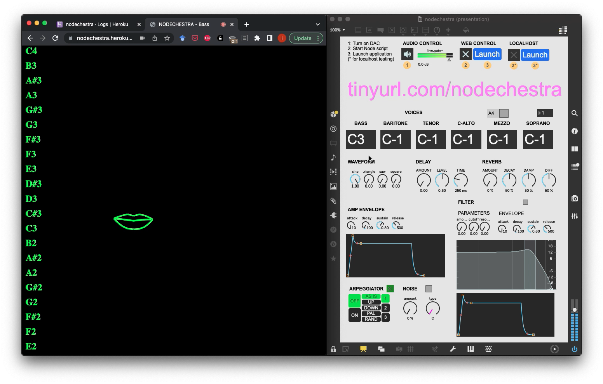

# Nodechestra
## Description
*Nodechestra* is a participative gesture-controlled online synthesizer, harnessing real-time web communication to engage multiple users in collaborative virtual sound-making. This project is inspired by the seemingly ineluctable societal progression of dematerialization - amplified by recent pandemic times - and is situated in the lineage of cadavre exquis, poietic generators and social (media) experiments, seeking to create space for reembodied collective online play.
<br><br><br><br>
*Nodechestra* was built using [Node.js](https://nodejs.org/en/), an open-source JavaScript runtime providing a back-end server environment. Node supports the project’s basic server-client network architecture, consisting of an [Express.js](https://expressjs.com/) web application harnessing HTTP and WebSocket servers and framing URL routing. The built-in Node [HTTP module](https://nodejs.org/api/http.html) establishes the networked communication between the server and clients, while the WebSocket protocol, implemented here via individual [Socket.IO](https://socket.io/) libraries for server and client, enables sustained full-duplex communication between the two. *Nodechestra* is deployed as a web app using [Heroku](https://www.heroku.com/), a cloud application platform, enabling user access directly from their web browser.

The Node application captures user gestures using [MediaPipe](https://mediapipe.dev/), a framework supporting machine learning analysis of live media. In Nodechestra, this serves to recognize user body position and motion from their webcam feed, enabling somatic control of synthesizer parameters. 
This data is then piped to a [Max/MSP](https://cycling74.com/products/max) patch via a Node-Max/MSP API. It is then routed to an ad hoc Max/MSP poly~ synthesizer, modulating its parameters.

The synthesizer’s function is broken down into a set number of components (voices, waveform, amplitude envelope, reverb, etc..), which are parceled out to various eponymous client pages. The user triggers parameter changes using gestural control, the nature of which depends on their attributed parameter.

## [Demo](https://youtu.be/ZL5iTugi0Ug)

## Instructions
1. Download [project folder](https://github.com/ylliez/nodechestra) from GitHub
2. Download [Max/MSP application](https://cycling74.com/downloads) (free trial)
3. Open `nodechestra.maxpat` file
4. Turn on DAC (button 1) 
### Heroku deployment
5. Start Node Heroku script (button 2)
6. Launch Heroku application (button 3)
### Localhost testing
5. Start Node localhost script (button 2*) 
6. Launch localhost on port 4200 (button 3*)
### Audio issues
7. Open Audio status window (button 9)
8. Ensure 'Output Device' is set to your preferred output

## Components

| name        | function                  | detail  | parameters                       |          
| -           | -                         | -       | -                                |        
|             |                           |         |                                   
| bass        | bass choral voice         |  mouth  | Y: frequency  / open: trigger         
| baritone    | baritone choral voice     |  mouth  | Y: frequency  / open: trigger         
| tenor       | tenor choral voice        |  mouth  | Y: frequency  / open: trigger         
| contralto   | contralto choral voice    |  mouth  | Y: frequency  / open: trigger         
| mezzo-sop   | mezzo-sop choral voice    |  mouth  | Y: frequency  / open: trigger         
| soprano     | soprano choral voice      |  mouth  | Y: frequency  / open: trigger         
|             |                           |         |                                       
| waveform    | waveform panning          |  hands  | RX: continuous / LX: discrete         
| envelope    | envelope ADSR             |  hands  | LY: A / LY: D / RY: S / RX: R         
|             |                           |         |                                       
| noise       | noise parameters          |  hands  | RY: amt / LX: colour                  
| delay       | delay parameters          |  hands  | RY: amt / LX: time                    
| reverb      | reverb parameters         |  pose   | Lsh amt / Lin dec / Rin dam / Rsh diff
|             |                           |         |                                       
| filter      | filter parameters         |  hands  | RY: amt / LX: freq / LY: resonance    
| envelope    | filter envelope ADSR      |  hands  | LY: A / LY: D / RY: S / RX: R         
|             |                           |         |                                       
| arpeggiator | arpeggiator parameters    |  hands  | RY: duty / LX: rate                              
|             |                           |         |                              

## R&D
### [MediaPipe](https://google.github.io/mediapipe/)
- Hands
    - [Hand implementation](https://google.github.io/mediapipe/solutions/hands)
    - [Hand landmarks](https://mediapipe.dev/images/mobile/hand_landmarks.png)
    - [Hands Codepen](https://codepen.io/mediapipe/pen/RwGWYJw)
- Face Mesh
    - [Face Mesh implementation](https://google.github.io/mediapipe/solutions/face_mesh)
    - [Face Mesh landmarks](https://github.com/google/mediapipe/blob/master/mediapipe/modules/face_geometry/data/canonical_face_model_uv_visualization.png)
- Pose
    - [Pose](https://google.github.io/mediapipe/solutions/pose)
    - [Pose landmarks](https://mediapipe.dev/images/mobile/pose_tracking_full_body_landmarks.png)
    - [Pose Codepen](https://codepen.io/mediapipe/pen/jOMbvxw)

### [Vocal Ranges](https://www.wikidoc.org/index.php/Vocal_range) & [MIDI equivalents](https://www.inspiredacoustics.com/en/MIDI_note_numbers_and_center_frequencies)

| CHORAL | note | MIDI | # |  
| - | - | - | - |
Soprano | C4-A5 | 60-81 | 22
Mezzo-Soprano | A3-F5 | 57-77 | 21
Contralto | F3-D5 | 53-74 | 22
Tenor | B2-G4 | 47-67 | 21
Baritone | G2-E4 | 43-64 | 22
Bass/Basso | E2-C4 | 40-60 | 21

| OPERATIC | note | MIDI | # |  
| - | - | - | - |            
Soprano | C4-C6 | 60-84 | 25
Mezzo-Soprano | A3-A5 | 57-81 | 25
Contralto | E3-E5 | 52-76 | 25
Tenor | C3-C5 | 48-72 | 25
Baritone | G2-G4 | 43-67 | 25
Bass | E2-E4 | 40-64 | 25                          

### UI
- [Virtual Synth](https://virtual-synth.netlify.app/)/[GH](https://github.com/gauthammk/Virtual-Synth)
- [Web Audio API synth](https://www.dabbmedia.com/web-audio/synth/)/[GH](https://github.com/dabbmedia/web-audio-synth)
- [CSS toggle switch](https://www.w3schools.com/howto/howto_css_switch.asp) -> irrelevant
- [favicon](https://icon-icons.com/icon/perfect-circle/53928)

### Heroku
- Heroku set-up, tie repo & deploy -> NO : crash, issue with package.json start script ==> change to server script
- retest (& try in VSC terminal) -> NO : crash; issue w/ max-api usage -> try [max-api-or-not](https://github.com/dimitriaatos/max-api-or-not)
- retest -> NO : crash, "Web process failed to bind to $PORT within 60 seconds of launch" ; just too slow
- retest -> NO : still slow error despite build "succeeded" & "deploy" awa attempt to open app & access local host...
- retest -> NO : still crash ->
- 12/02: Deployed but H14 (no web processes running) -> subscribe to Eco Dynos & scale project dynos to 1 (https://devcenter.heroku.com/articles/scaling)

[error codes](https://devcenter.heroku.com/articles/error-codes)  
[dynos](https://devcenter.heroku.com/articles/dynos)

### Procedural page generation
- [EJS](https://ejs.co/)
- [Vue](https://vuejs.org/)
    - https://www.npmjs.com/package/vue-socket.io
    - https://deepinder.me/creating-a-real-time-chat-app-with-vue-socket-io-and-nodejs
    - https://blog.openreplay.com/rendering-real-time-data-with-vue-node-and-socket-io
- React
    - https://www.freecodecamp.org/news/build-a-realtime-chat-app-with-react-express-socketio-and-harperdb/

## Issues
- [x] component parcellation -> OK : resolved by socket.io implementation  
- [x] disconnect crash -> OK : resolved by socket.io implementation  
- [ ] s2c GUI value change -> NO : irrelevant due to compartmentalization => or not..  
- [ ] s2c audio feed -> NO : AFAIK not possible  
- [x] ML control -> OK : +/- implemented (debugging as aeternam)  
- [ ] Data control? -> TBD  
- [x] Actual client network access -> Heroku deployment of GitHub repo) => CSC  
- [x] routing : express routes || socket.io namespaces ->   
- [ ] namespaces vs. rooms  
- [x] attributing/serving pages : OK -> user choice (capped connections)  
- [ ] procedurally generating HTML/JS pages : EJS/React/Vue?         
- [ ] [clamp](https://www.webtips.dev/webtips/javascript/how-to-clamp-numbers-in-javascript) [values](https://stackoverflow.com/questions/11409895/whats-the-most-elegant-way-to-cap-a-number-to-a-segment)?  
- [x] draw UI elements of MediaPipe   
    - lips: https://github.com/google/mediapipe/issues/2040
- [x] Max/MSP client connection:  
```
const io = require("socket.io-client");
// const socket = io('http://localhost:4200');
// const socket = io("https://nodechestra.herokuapp.com/");
// const socket = io.connect('https://nodechestra.herokuapp.com');
// const socket = io("/max").connect('https://nodechestra.herokuapp.com');
const socket = io("https://nodechestra.herokuapp.com/max");
```
- [ ] landing page UI
- [ ] on-page instructions?
- [ ] waveform GUI
